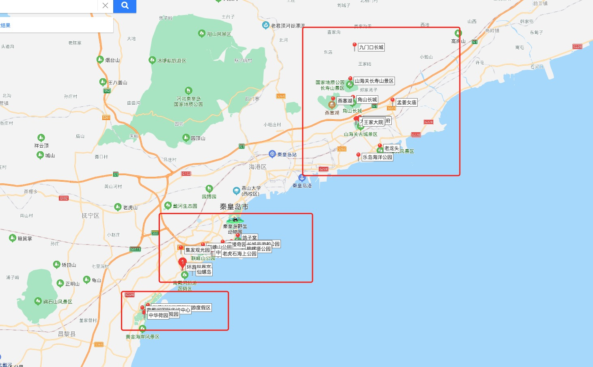

# 10月1 秦皇岛的出行计划

## 参考连接
* https://baijiahao.baidu.com/s?id=1603031915783751942&wfr=spider&for=pc
* https://m.kkqhd.com/jdgl/2201.html

## 位置梳理

* 位置主要分为3大块
1. 北戴河、山海关
2. 秦皇岛市区
3. 南戴河

## 必须要去的地方
* 鸽子窝公园 游玩2-3小时 早起看日出
* 山海关 天下第一关
* 碧螺塔公园 海中栈道